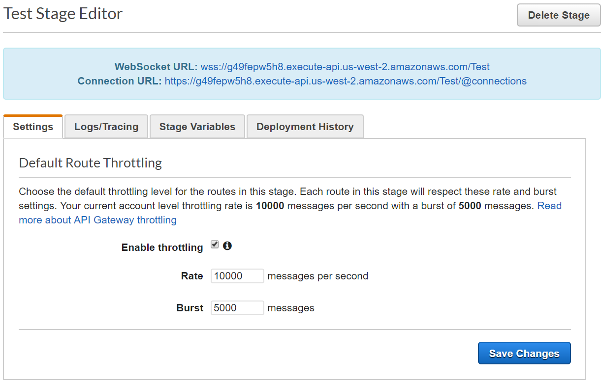

# aws-gateway-web-socket
Performance test of AWS API Gateway with Web Socket using C#

## Usage ##

The example was created with Serverless Framework, AWS DynamoDB, AWS API Gateway, AWS Lambda, C# as language & Artillery as loading testing tool

### Create tables Connection & Assets ###

```sh
aws dynamodb create-table --table-name Assets --attribute-definitions AttributeName=ContractId,AttributeType=S \
--key-schema AttributeName=ContractId,KeyType=HASH --provisioned-throughput ReadCapacityUnits=5,WriteCapacityUnits=5

aws dynamodb create-table --table-name Connection --attribute-definitions AttributeName=ConnectionId,AttributeType=S \
--key-schema AttributeName=ConnectionId,KeyType=HASH --provisioned-throughput ReadCapacityUnits=5,WriteCapacityUnits=5
```

After create the table Assets, populate with dummy data

### Build application ###

```sh
cd csharp-ws/
./build.sh
```

**Deploy application**
```sh
sls deploy
```

### Create API Gateway ###

To create a WebSocket API using the API Gateway console

1. Sign in to the API Gateway console and choose Create API.
1. Under Choose the protocol, choose WebSocket.
1. Under Create a new API, choose New API.
1. Under Settings, in the API name field, type the name of your API, for example, AssetApi.
1. Enter a Route Selection Expression for the API: $request.body.action.
1. Choose Create API.
1. Select $connect route, select LambdaFunction as IntegrationType and then select csharp-ws-dev-connect
1. Select $disconnect route, select LambdaFunction as IntegrationType and then select csharp-ws-dev-disconnect 
1. Add new route key: message, select LambdaFunction as IntegrationType and then select csharp-ws-dev-message
1. Click on actions and then on Deploy API



### Test application ###

Test WebSocket with [wscat](https://www.npmjs.com/package/wscat)

```sh
wscat -c wss://<<applicationid>>.execute-api.<<region>>.amazonaws.com/Test
```

After open connection, send a message and you will get the response, use ContractId valid
```sh
{ "action": "message", "ContractId": "A100" }
```

You will get a response like this
```sh
{"InstrumentId":{"Value":"444850","Type":1},"ContractId":{"Value":"A100","Type":0}}
```

### Performance test ###

Load performance test using [artillery](https://artillery.io/docs/getting-started/)
```sh
artillery run loadtest-wss.yml
Started phase 0, duration: 10s @ 13:50:06(-0500) 2019-06-11
Report @ 13:50:16(-0500) 2019-06-11
Elapsed time: 10 seconds
  Scenarios launched:  99
  Scenarios completed: 0
  Requests completed:  95
  RPS sent: 10.11
  Request latency:
    min: 0.1
    max: 0.8
    median: 0.2
    p95: 0.4
    p99: 0.7
  Codes:
    0: 95

Report @ 13:50:26(-0500) 2019-06-11
Elapsed time: 20 seconds
  Scenarios launched:  1
  Scenarios completed: 95
  Requests completed:  5
  RPS sent: 0.5
  Request latency:
    min: 0.2
    max: 0.7
    median: 0.3
    p95: 0.7
    p99: 0.7
  Codes:
    0: 5

Report @ 13:50:27(-0500) 2019-06-11
Elapsed time: 20 seconds
  Scenarios launched:  0
  Scenarios completed: 5
  Requests completed:  0
  RPS sent: NaN
  Request latency:
    min: NaN
    max: NaN
    median: NaN
    p95: NaN
    p99: NaN

All virtual users finished
Summary report @ 13:50:27(-0500) 2019-06-11
  Scenarios launched:  100
  Scenarios completed: 100
  Requests completed:  100
  RPS sent: 5.02
  Request latency:
    min: 0.1
    max: 0.8
    median: 0.2
    p95: 0.4
    p99: 0.7
  Scenario counts:
    0: 100 (100%)
  Codes:
    0: 100
```

Play with the code! :smile:
